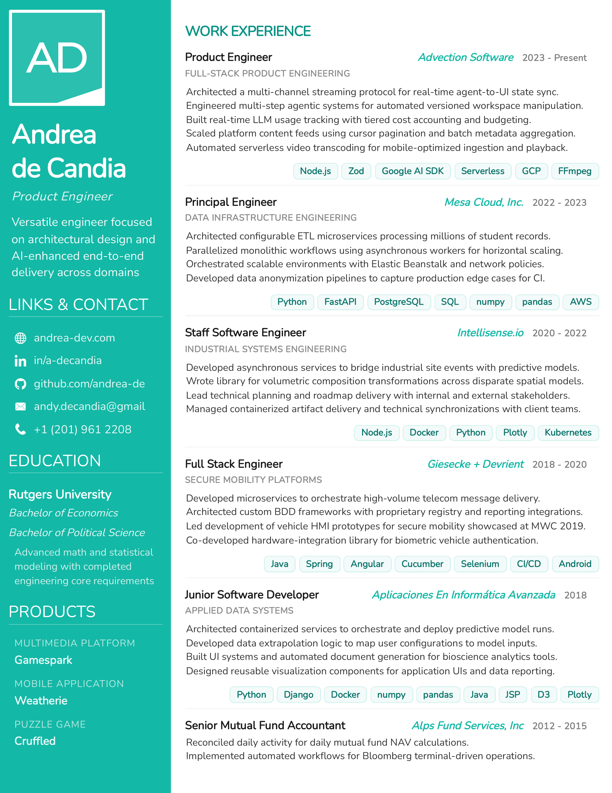

# Resume Project

This resume is built with **Petite-Vue** and **UnoCSS**. It dynamically fetches data from `resume.json` and `icons.json`.

## Quick View


## How to View Locally
Because it fetches external JSON data, it **must be served via a web server** to work correctly.

### Option 1: Using Node.js
```bash
npx serve .
```

### Option 2: Using Python
```bash
python3 -m http.server
```

Once running, visit `http://localhost:3000` (or the port provided) to view the resume.

---

## How to Print (PDF & PNG)
You can generate a PDF and a high-quality PNG preview in one command. This script requires **Google Chrome** (or Chromium) and **poppler-utils** (`pdftoppm`).

```bash
./print.sh
```

This will output:
- `resume.pdf`
- `resume-preview.png`